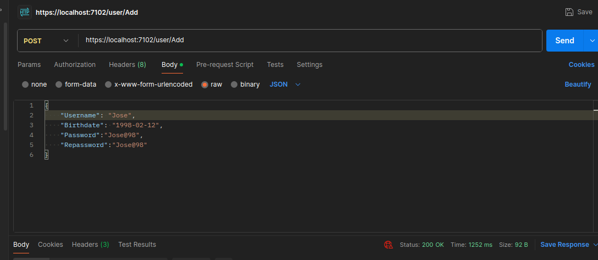
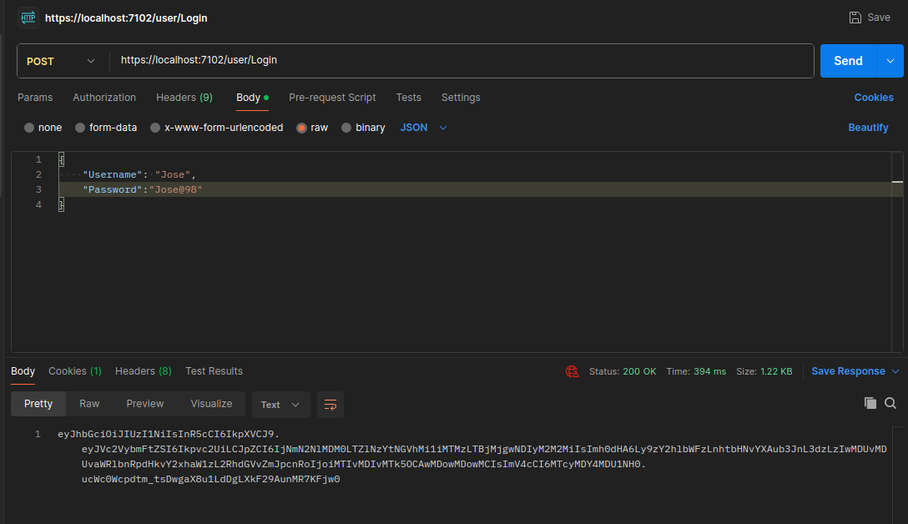
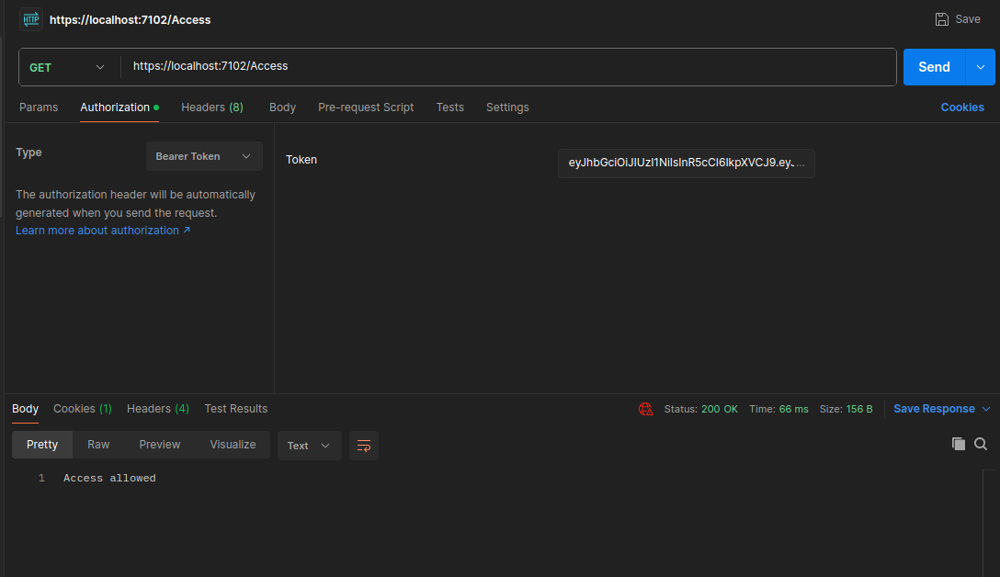

# API de Controle de Usuários
O objetivo desse projeto é criar uma API .NET que permite a criação de usuários de uma aplicação. Nela é possível realizar a validação de Login, geração de Tokens JWT e criação de politicas de acesso.

## Instalação
### Pré-requisitos

- [.NET SDK](https://dotnet.microsoft.com/en-us/download/dotnet/6.0) (versão 6.0.132)
- [MySQL](https://www.mysql.com/downloads/) (versão 8.0.37)

### Passos para Instalação

1. **Clone o Repositório**
   ```bash
   git clone https://github.com/seu-usuario/api-de-Controle-Usuarios.git
   cd api-de-controle-usuarios
   ```
2. **Configuração do Banco de Dados**
    
    Como o projeto tem fins didáticos a string de conexão está diretamente em [appsettings.json](./appsettings.json), faça as alterações necessárias para conectar no seu Banco de Dados MySql.

3. **Dependências e Migrações** 
    ```bash
    dotnet restore
    dotnet ef database update
    ```
4. **Execução**
    ```bash
    dotnet run
    ```
## Funcionamento
A [classe de usuário](./models/user.cs) desse projeto herda de [IdentityUser](https://learn.microsoft.com/pt-br/dotnet/api/microsoft.aspnetcore.identity.entityframeworkcore.identityuser?view=aspnetcore-1.1) e possui como atributo além dos herdados o `BirthDate`, que é usado na [Politica de acesso](./Authorization/AgeAuthorization.cs), que no caso de uma request em `/access` só valida o token caso o usuário tenha mais de 18 anos.

### Criação de usuário


### Validação de Login e geração de Token


### Politca de Acesso
Observe o que que o [Bearer Token](https://swagger.io/docs/specification/authentication/bearer-authentication/) enviado é o mesmo recebido na requisição anterior.


## Códigos de resposta
- **200 OK**: Requisição bem-sucedida.
- **201 Created**: Recurso criado com sucesso.
- **400 Bad Request**: Requisição malformada ou parâmetros inválidos.
- **404 Not Found**: Recurso não encontrado.
- **500 Internal Server Error**: Erro no servidor.